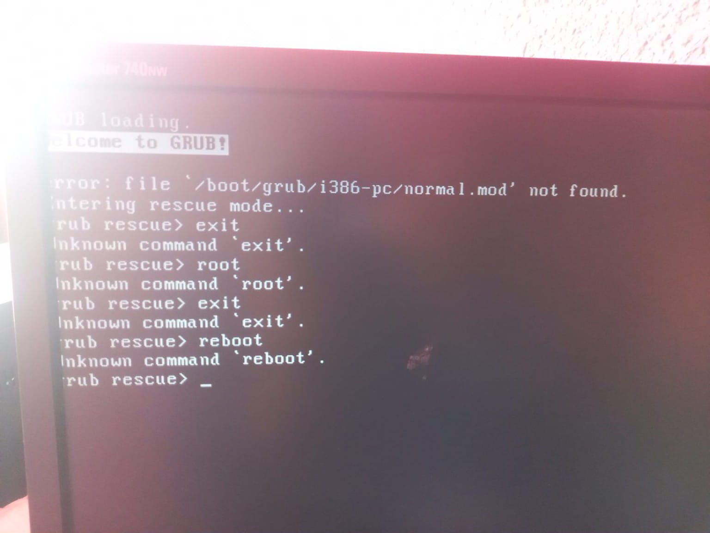
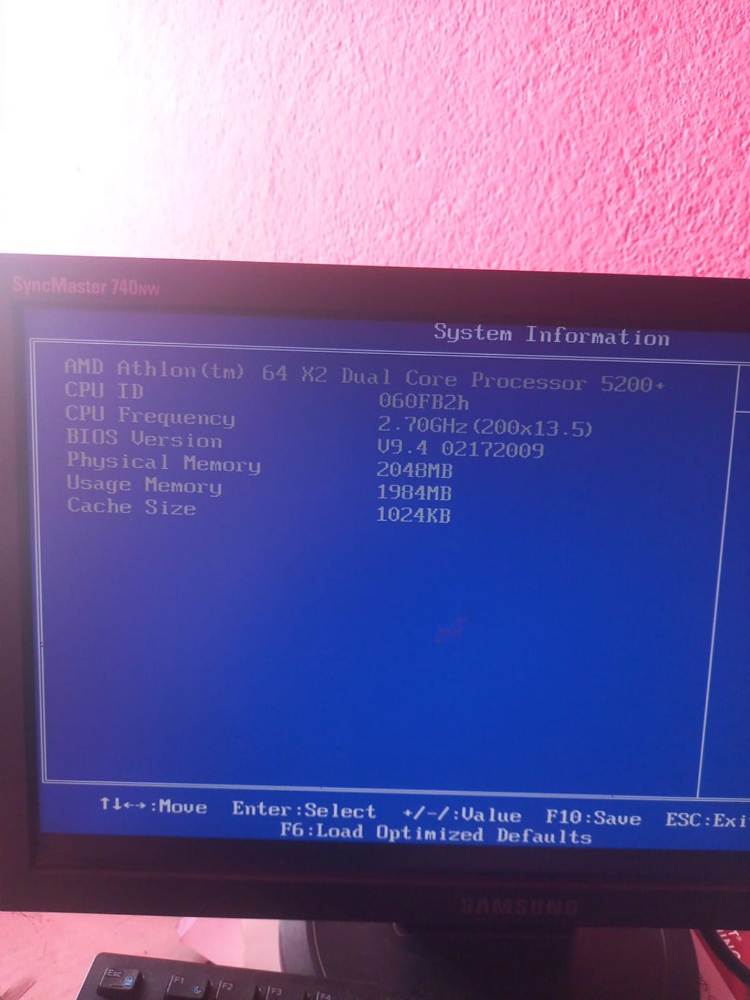
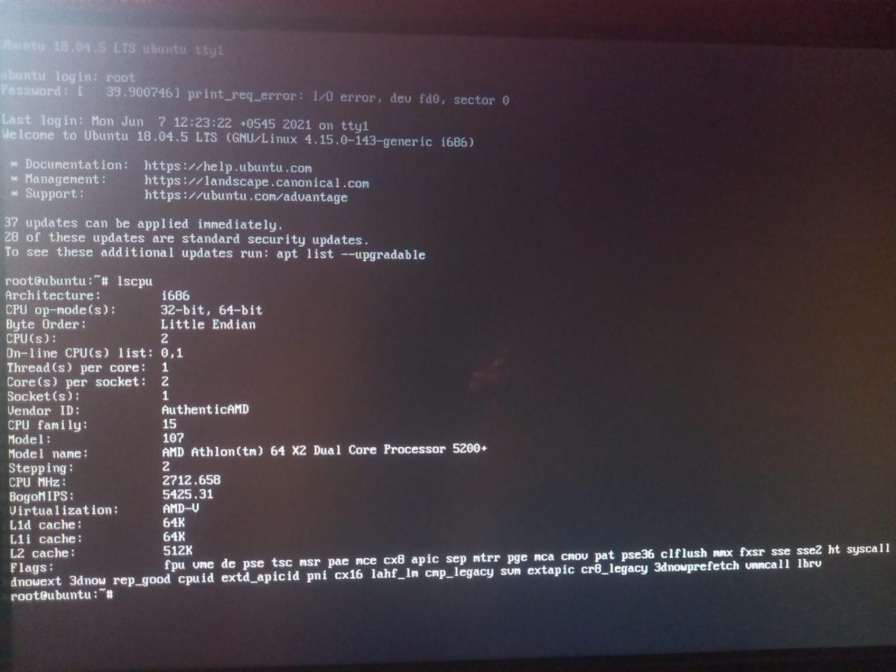

# Daily Journal - 2026-08-02

## Today's Tasks
- Install ALMALinux 10 minimal in that PC.

## Screenshots
Here is the final working configuration:

## Challenges Faced
- While installing Almalinux minimal it failed and gave this grubrescue error.

- Later we found out it is because of formating in iso mode which  didnot work for me i use DD mode   which does raw
byte to byte instead of FAT 32 format. Because my PC was too much old.

I also did rw init=/bin/bash

this help me to reset my old rootpassword.
 
I then did lscpu

## Tomorrow's Plan
- Couldnot make it happen. So i am installing ubuntu 22.04 server LTS

