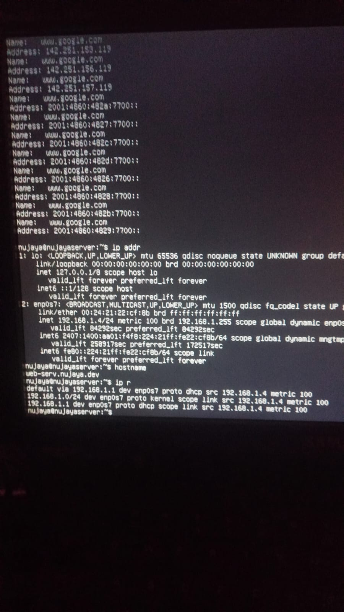
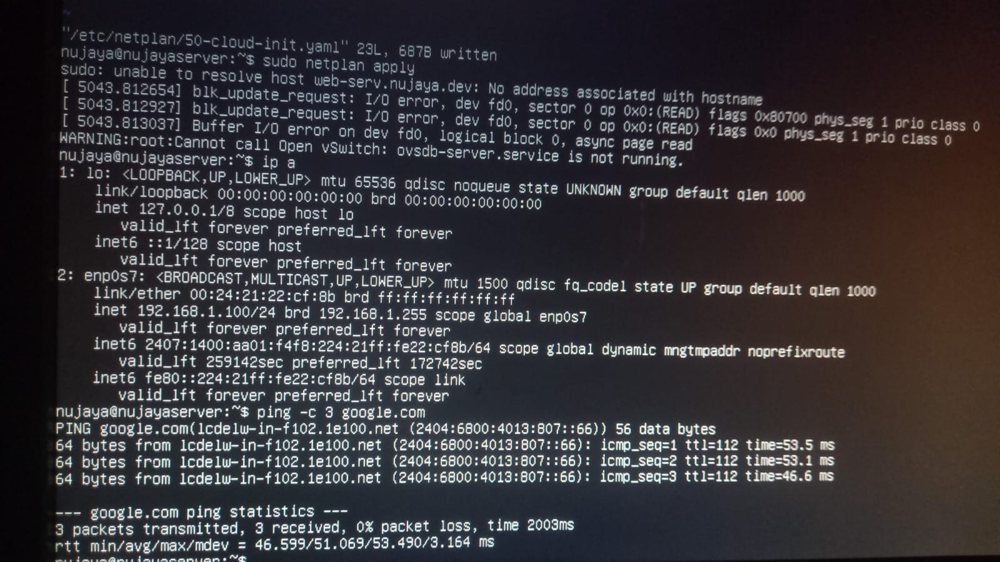
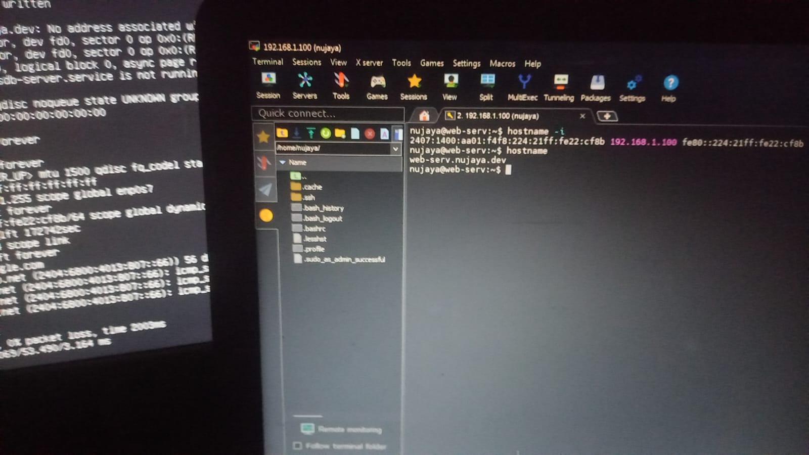

# Daily Journal - 2026-08-09

## Today's Tasks
- LAN Connection CPU with router and change DHCP ip into static.

##What I did?
1) I recieved   DHCP ip 192.168.1.4.
2) Changed the hostname of webserver to web-serv.nujaya.dev

3)check route $ip r ,checked  ipaddress $ ip addr

4)dhcp ip into static ip
sudo vi /etc/netplan/50-cloud-init.yaml

5)new config

network:
  ethernets:
	enp0s7:
           dhcp4: false
	   addresses:
             - 192.168.1.100/24
	   routes:
             - to: default
	       via: 192.168.1.1
           nameservers:
	       addresses: [8.8.8.8, 1.1.1.1]	
   version: 2

6)then sudo netplan apply,apllies config

7)ping -c 4 google.com

## Result
Ping was succesfull in static IP.

SSH was succesfull.

## Challenges Faced
Identation error occured. 
Loadshedding.
I had to push  my commits to github but  remote repo already had   somefiles. so there was problem during push.
And as i am using vscode inside office PC vm. it was not easy to  limk remote repo. 
i created ssh-keygen and copy that public key to git hub and aslo  did ssh to that repo to push files.
as it is inside corporate environment i had to use 443 port. 
((.venv) ) [test@ashisb-maharjan my_server_projects]$ git add .
((.venv) ) [test@ashisb-maharjan my_server_projects]$ git commit -m" deleted local file before merge"
((.venv) ) [test@ashisb-maharjan my_server_projects]$ git pull --no-rebase origin main
((.venv) ) [test@ashisb-maharjan my_server_projects]$ git pull --no-rebase --allow-unrelated-histories origin main
((.venv) ) [test@ashisb-maharjan my_server_projects]$ git remote set-url origin ssh://git@ssh.github.com:443/nujayabia/web_server_journal.git
((.venv) ) [test@ashisb-maharjan my_server_projects]$ git push -u origin main

## Tomorrow's Plan
- Worked I am happy now need to do hardening of OS and SSH connection.

