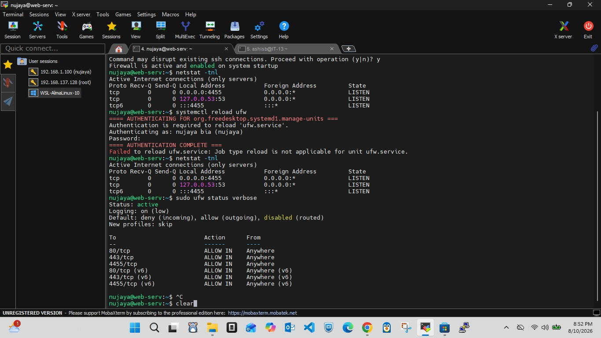
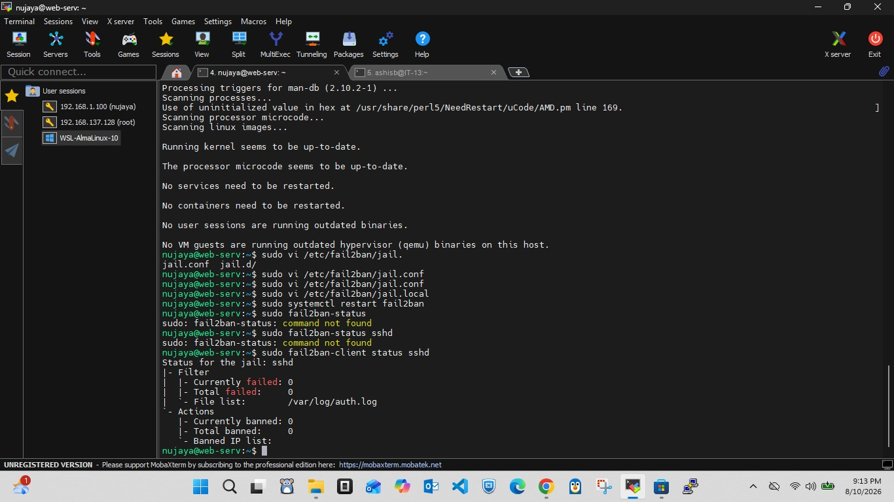
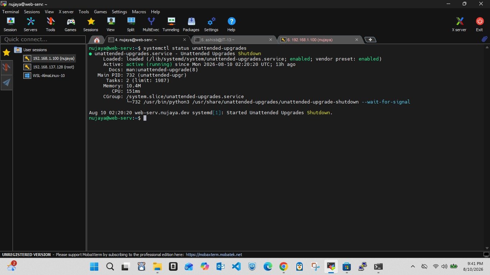

# Daily Journal - 2026-08-10_PM

## Today's Tasks
- Harden the Ubuntu 22.04 server before exposing it to the internet.

## What We Did (With Reasons)

### 1. Verified non‑root admin user (`nujaya`)
**Why:** Never use `root` directly. If compromised, an attacker would own the whole machine. A separate admin with `sudo` limits damage.

### 2. SSH Key Authentication & Disabled Passwords
**Why:** Passwords can be guessed or brute‑forced. SSH keys are mathematically unbreakable. Once keys work, we can disable password login entirely, closing the biggest door to attackers.

- Generated an SSH key pair on my laptop.
- Copied the public key to the server (`ssh-copy-id`).
- Tested password‑less login successfully.

### 3. Hardened SSH Configuration (`/etc/ssh/sshd_config`)
Changes made:
- **Port:** `22` → `4455` (reduces automated bot scans, they target port 22)
- **PermitRootLogin:** `no` (root can never SSH)
- **PasswordAuthentication:** `no` (keys only)
- **AllowUsers:** `nujaya` (only my user can SSH)

Restarted SSH and tested from a new terminal before closing the old session.

### 4. Enabled UFW Firewall
**Why:** By default, Ubuntu has no firewall. UFW ensures only the services I intend to expose are reachable.

Allowed ports:
- `4455/tcp` (SSH)
- `80/tcp` (HTTP)
- `443/tcp` (HTTPS)

All other incoming traffic is denied. Verified with `ufw status verbose`.

### 5. Installed & Configured Fail2ban
**Why:** Even with keys, bots will try to connect and fail. Fail2ban automatically bans IPs after repeated failures, reducing noise and adding a second layer of protection.

- Created `/etc/fail2ban/jail.local` to monitor SSH on port `4455`.
- Set `maxretry = 4`, `bantime = 1h`.
- Enabled and started the service.

### 6. Set Up Automatic Security Updates (`unattended-upgrades`)
**Why:** Critical security patches are released frequently. The server will now install them automatically, so I don't have to remember to run `apt update` every day.

## Outcome
- SSH now works only via key on port `4455`.
- Firewall blocks everything except the three needed ports.
- Fail2ban will lock out brute‑force attempts.
- The system will keep itself patched.

Server is now ready for the next phase: installing Nginx, PHP, MariaDB, and making it accessible from the internet.