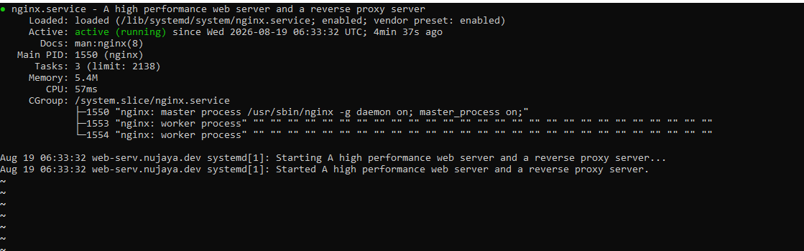
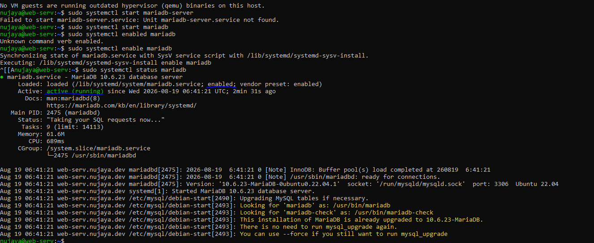
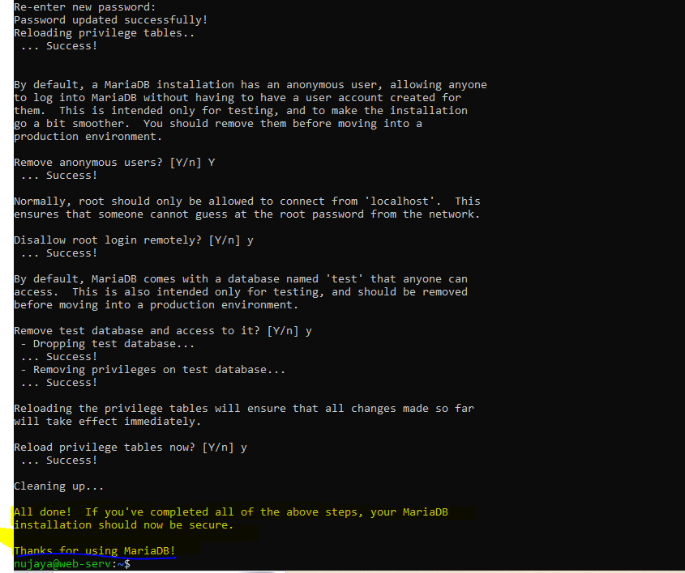
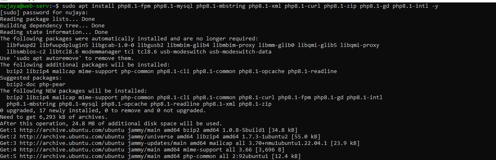
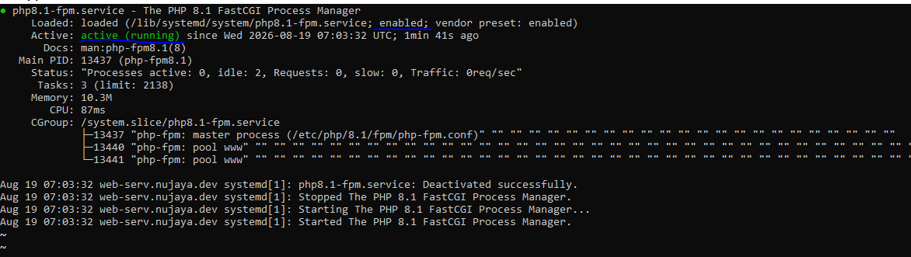
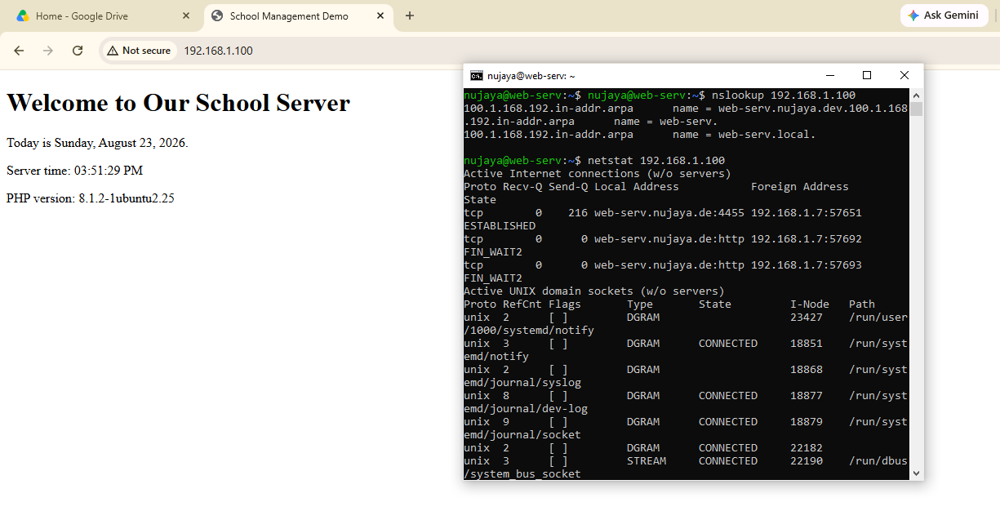

# Daily Journal - 2026-08-23
(work done on 2026-08-19)

## Today's Tasks
- Install Nginx web server.
- Install and secure MariaDB database server.
- Host a simple `index.html` page on the local network.

## What I Did

### 1. Installed Nginx
- Installed Nginx with `sudo apt install nginx -y`.
- Started and enabled the service.
- Verified the default Nginx welcome page from another device on the LAN.
- Created a custom site configuration at `/etc/nginx/sites-available/school`.
- Removed the default site symlink to prevent conflicts.
- Created a simple `index.html` inside `/var/www/school` and made it accessible at `http://192.168.1.100`.

**Why Nginx?**  
It's lightweight and handles many connections efficiently on old hardware – ideal for this dual‑core PC.

**Fig: Nginx Install**


### 2. Installed MariaDB
- Installed MariaDB with `sudo apt install mariadb-server -y`.
- Secured the installation using `mysql_secure_installation`:
  - Set a root password.
  - Removed anonymous users.
  - Disabled remote root login.
  - Removed the test database.
- The service is now running and ready for future database creation.

**Why MariaDB?**  
It will store data and is fully open source.

**Fig: Mariadb Install**


**Fig: Mariadb Hardening**



### 3. Installed PHP-FPM and Extensions
- Installed PHP 8.1 FPM and necessary extensions:
  ```bash
  sudo apt install php8.1-fpm php8.1-mysql php8.1-mbstring php8.1-xml php8.1-curl php8.1-zip php8.1-gd php8.1-intl -y

**Why php-fpm**
Started and enabled the service.

Created a temporary phpinfo() file to confirm PHP was working with Nginx, then removed it for security.
Nginx itself cannot execute PHP code. PHP-FPM (FastCGI Process Manager) is the service that processes PHP files
and returns the result to Nginx. It is efficient, uses fewer resources, and is the standard way to run PHP with Nginx.

**Fig: PHP Install**


**Fig: PHP-FPM**


### 4. Hosted a Placeholder Page
- Created `/var/www/school/index.html` with a simple welcome message.
- Confirmed the page loads correctly in a browser on the local network.

## Problems Faced & Solutions

### Problem 1: Static IP Not Surviving Reboot
- due to night duty whole week and other problems  was not able to manage time.
- not even been able to journal what i did on 2026-08-19
-So doing it today 2026-08-23

### Problem 2: Nginx Default Page Still Showing
- **Issue:** After configuring the `school` site, `http://192.168.1.100` still showed the default Nginx page.
- **Cause:** The default site symlink was still enabled and catching all requests.
- **Solution:** Removed the default symlink and linked the `school` site. Reloaded Nginx.
- **Result:** Custom page now loads correctly.

## Current State
- Server is accessible at `192.168.1.100` on the LAN.
- Nginx is serving a simple HTML page from `/var/www/school`.
- MariaDB is installed, secured, and ready for use.

**Fig: Test site working**




## Next Steps
- Upload the actual school management system.
- Create a database and user in MariaDB for the application.
- Expose the server to the internet (Dynamic DNS, port forwarding, SSL).
- Create a restricted SSH user for the developer.