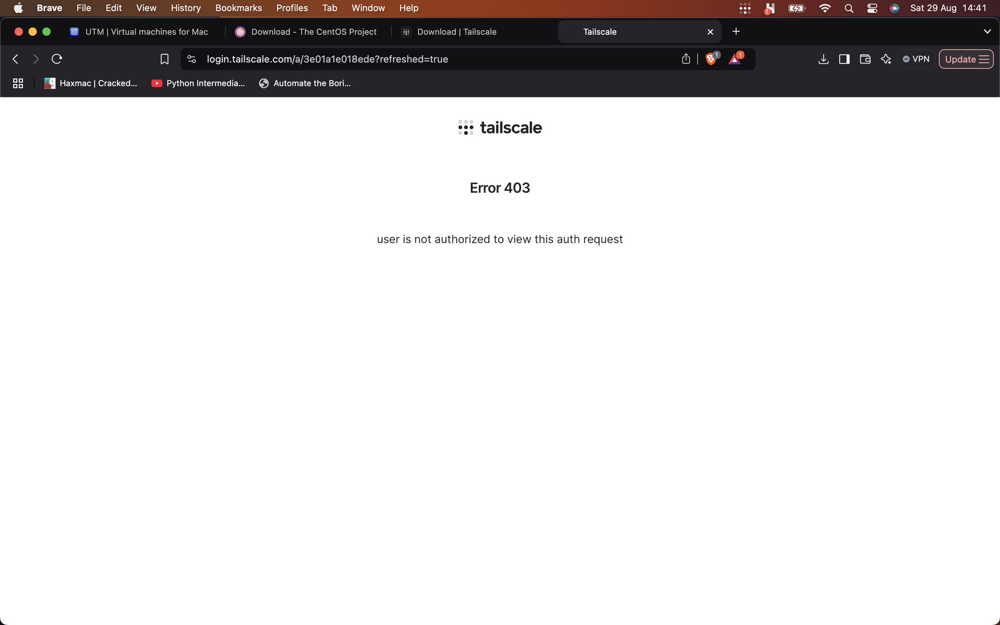
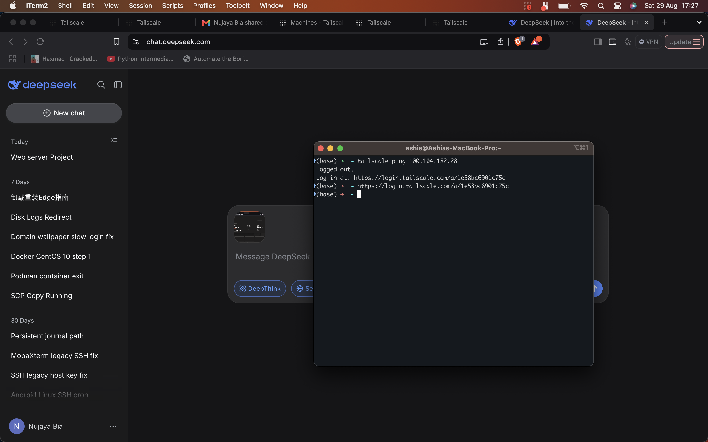
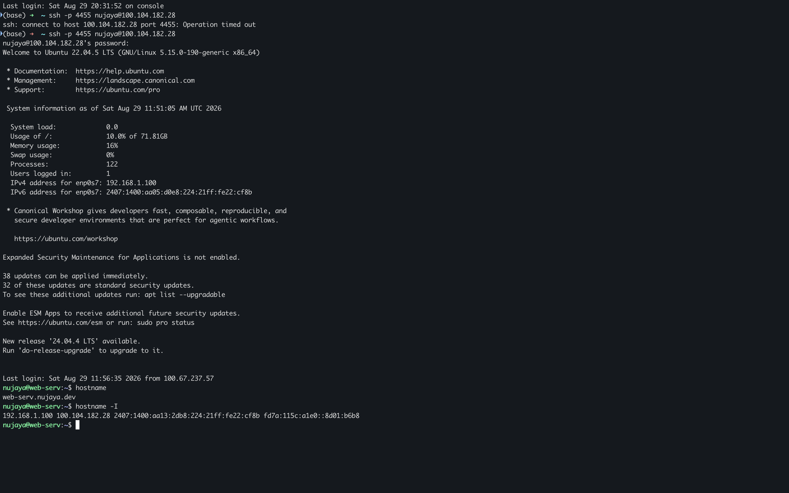
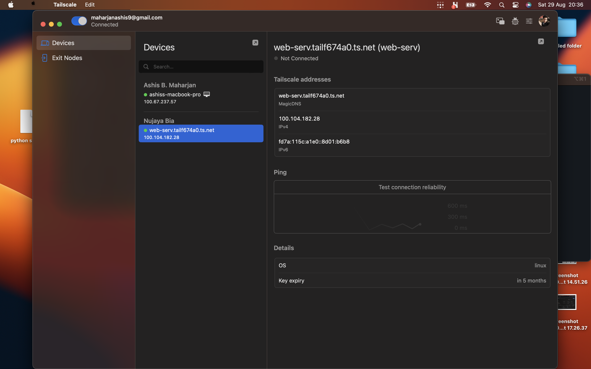

# Daily Journal - 2026-08-29

## Today's Focus
- Set up Tailscale for secure remote access behind CGNAT.
- Understand why port forwarding fails with CGNAT.
- Begin domain registration process (.com.np).
- Create a restricted developer account.


## Key Learnings

### 1. CGNAT and Why Port Forwarding Fails
- My ISP uses CGNAT, meaning my router does not have a real public IP.
- Inbound connections from the internet cannot reach my server because the ISP's gateway doesn't know which customer to forward to.
- Outbound connections (like browsing Facebook) work because the NAT remembers the state and routes replies back.

### 2. Tailscale as a Solution
- Tailscale creates an outbound tunnel from my server to Tailscale's coordination servers.
- Other devices that also connect to Tailscale (and are on the same tailnet or have nodes shared) can communicate via that tunnel.
- Each device gets a Tailscale IP in the `100.64.0.0/10` range.
- This bypasses CGNAT completely, enabling SSH access from anywhere without public IP or port forwarding.

### 3. Sharing Nodes with Different Accounts
- I do not need to share my personal Tailscale account credentials.
- Tailscale allows **node sharing**: I can share my server node with another Tailscale account (e.g., developer's email) from the admin console.
- The developer then sees the server in their Tailscale app and can connect using the server's Tailscale IP.

## Problems Faced & Solutions

### Problem 1: Tailscale Devices Not Communicating (Different Tailnets)
- **Issue:** Installed Tailscale on both the Mac and the server, but they could not ping each other or SSH. `tailscale ping` failed.
- **Cause:** Both devices were logged into **different Tailscale accounts**, so they were on **separate tailnets**. Tailscale devices can only see each other if they are on the same tailnet or if nodes are explicitly shared.
- **Solution:** Used Tailscale's **node sharing** feature. From the admin console (the account used on the server), shared the server node with the Mac's Tailscale account email. After accepting the share, both devices appeared in each other's `tailscale status`, and communication (ping + SSH) succeeded.
- **Result:** Now Mac can SSH to the server using the server's Tailscale IP (`100.104.182.28`), even though they use different accounts.

### Problem 2: Could Not Reach Server via LAN IP from Another Network
- **Issue:** Trying `ssh -p 4455 nujaya@192.168.1.100` from a machine on a different network gave "No route to host."
- **Cause:** `192.168.1.100` is a private LAN IP only reachable within the home network.
- **Solution:** Use the server's Tailscale IP (`100.104.182.28`) when connecting from outside the LAN. Install Tailscale on the client machine and ensure it's on the same tailnet (or shared).

### Problem 3: Tailscale CLI Saying "logged out"
- **Issue:** `tailscale ping 100.104.182.28` from Mac reported "logged out" even though the Tailscale GUI seemed connected.
- **Cause:** The command-line client was not authenticated separately.
- **Solution:** Ran `sudo tailscale up` in the terminal and authenticated with the same account. After that, `tailscale ping` and SSH worked.
		Before that client node hass its own tailnet and server has its own tailnet.


### Problem 4: Confusion About Domain Name (nujayabia.com.np vs ashisbmaharjan.com.np)
- **Issue:** Which domain to register, and how to reclaim an old one.
- **Solution:** Decided to first reclaim `ashisbmaharjan.com.np` (personal, matches name) via account recovery. Will later consider `nujayabia.com.np` if business registration is available.

## Tasks Completed

### 1. Tailscale Installation and Configuration
- Installed Tailscale on server using official script:
  ```bash
  curl -fsSL https://tailscale.com/install.sh | sh
  sudo tailscale up


