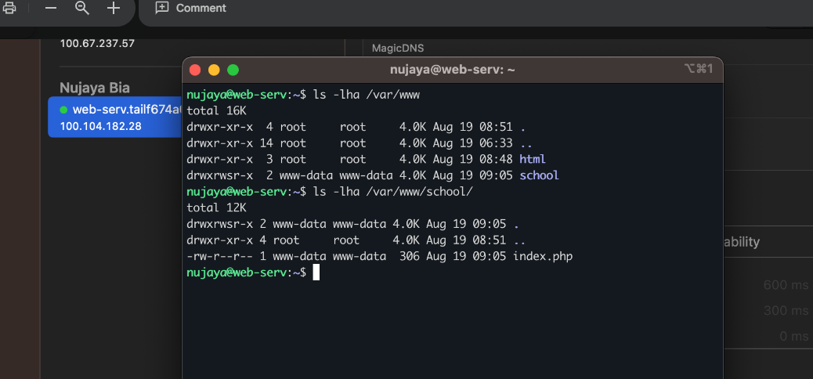
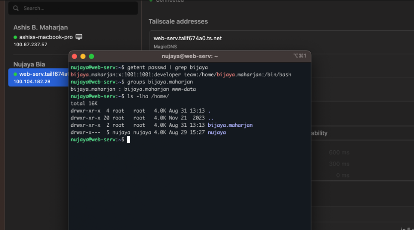
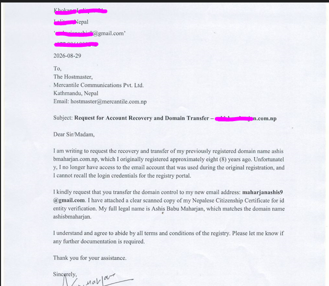
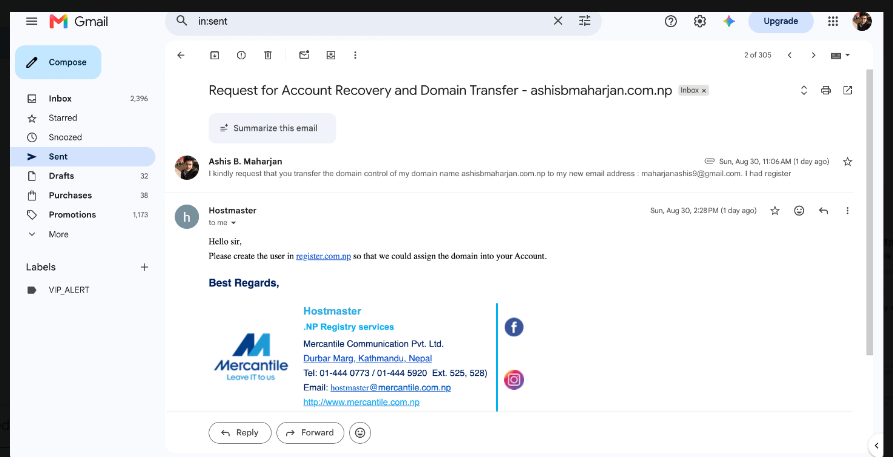

# Daily Journal - 2026-08-31

## Today's Tasks
- Create restricted developer account for remote collaboration.
- Harden SSH further (disable keyboard-interactive authentication).
- Set proper web root permissions for collaborative development.
- Prepare and send domain recovery request for ashisbmaharjan.com.np to Mercantile.

## What I Did

### 1. Created Developer Account
- Created a separate user `bijaya.maharjan` for the remote developer.
- Added `bijaya.maharjan` to the `www-data` group so they can edit web files without sudo.
- No sudo access given to `bijaya.maharjan`—they are limited to the web root.

**Why separate user?**  
It ensures the developer can only access what they need for the project, not the whole server. Adding them to `www-data` gives write access to web files only.



### 2. Hardened SSH Further
- Previously set `PasswordAuthentication no`, but password login still worked.
- Reason: `KbdInteractiveAuthentication` was still enabled.
- Fix: Set `KbdInteractiveAuthentication no` in `/etc/ssh/sshd_config`.
- Result: Password-based login completely disabled; only SSH keys work.

**Why disable keyboard-interactive?**  
SSH can ask for passwords in two ways: `PasswordAuthentication` and `KbdInteractiveAuthentication`. Disabling only one leaves the other open, so both must be `no` for full security.


### 3. Set Web Root Permissions
- Ownership: `www-data:www-data` for `/var/www/school`.
- Permissions: `775` for directories and files where needed.
- Applied setgid bit (`g+s`) on directories so new files inherit `www-data` group.
- This allows both the web server and developer to read/write without conflicts.

**Why setgid?**  
The setgid bit ensures that any new file or folder created inside `/var/www/school` automatically belongs to the `www-data` group, so the web server can always read it, no matter who creates it.



### 4. Prepared Domain Recovery for ashisbmaharjan.com.np
- Started recovery of `ashisbmaharjan.com.np` (registered 8 years ago, credentials lost).
- Wrote and sent an email to `hostmaster@mercantile.com.np` with:
  - Formal request letter (signed, scanned).
  - Copy of Nepalese Citizenship Certificate.
  - New email address for account transfer.
- Waiting for Mercantile's manual verification (2–3 business days expected).


**Why recover this domain?**  
It matches my legal name and was previously registered by me. Recovering it gives me a personal domain without starting from scratch.



## Problems Faced & Solutions

### Problem 1: Password Login Still Worked Despite `PasswordAuthentication no`
- **Issue:** SSH still prompted for password after setting `PasswordAuthentication no`.
- **Cause:** `KbdInteractiveAuthentication` was still `yes`, allowing password prompts via PAM.
- **Solution:** Added `KbdInteractiveAuthentication no` to `/etc/ssh/sshd_config`, restarted SSH.
- **Verification:** `sudo sshd -T | grep -E 'passwordauthentication|kbdinteractiveauthentication'` showed both as `no`.

### Problem 2: Developer Could Not Edit Files Without Sudo
- **Issue:** Initially, `/var/www/school` was owned by `www-data:www-data` with `755` permissions; developer `bijaya.maharjan` (in `www-data` group) could not write.
- **Solution:** Changed permissions to `775` and applied setgid bit:
  ```bash
  sudo chown -R www-data:www-data /var/www/school
  sudo chmod -R 775 /var/www/school
  sudo find /var/www/school -type d -exec chmod g+s {} \;