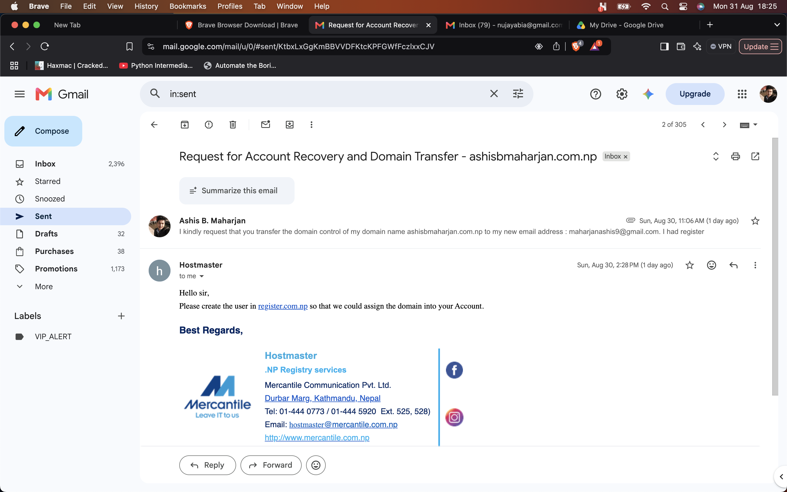
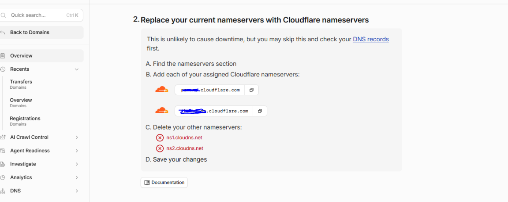
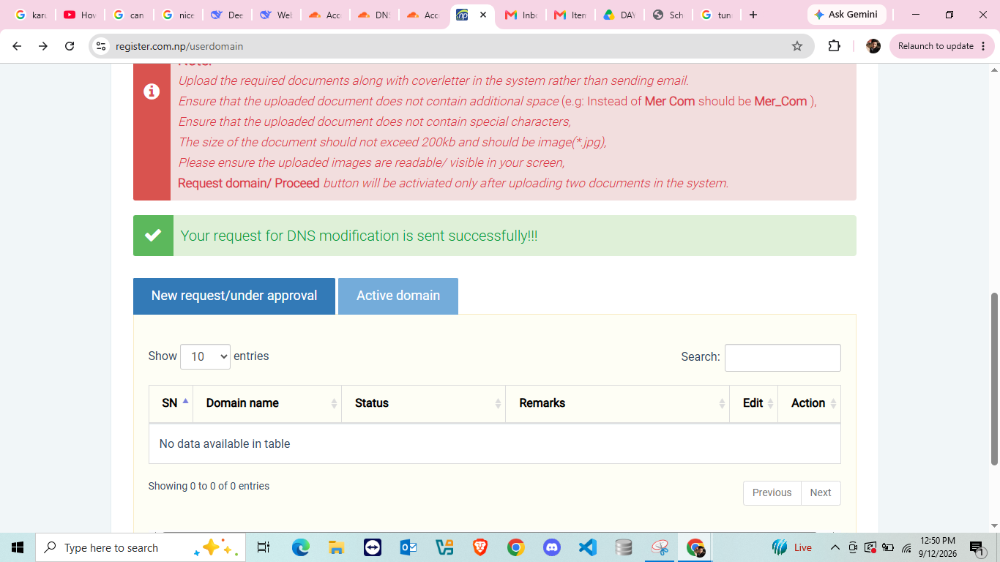
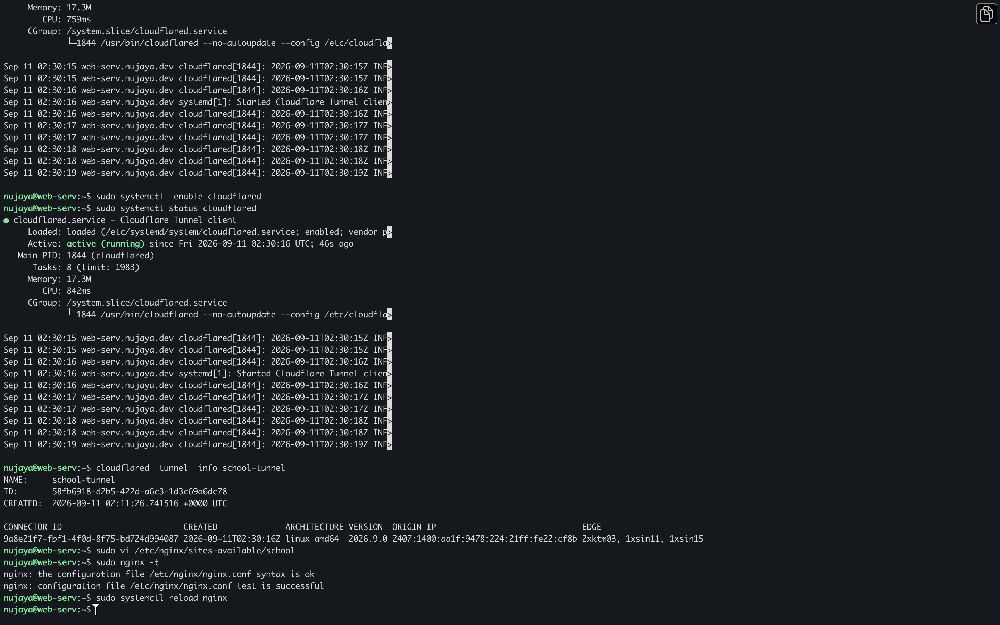
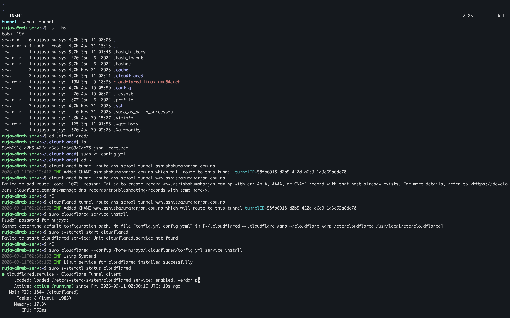
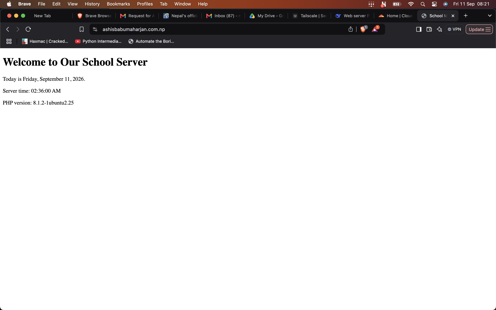

# Daily Journal - 2026-09-12

## Today's Focus
- Complete the Cloudflare Tunnel setup.
- Fix the `www` subdomain routing issue.
- Confirm public access to the website from anywhere in the world.

## The Domain Journey (A Long Road)

Getting a domain was not easy. We faced multiple rejections from Mercantile before finally succeeding.

### Attempt 1: Reclaiming `ashisbmaharjan.com.np` (Denied)
- This domain was registered by me around 8 years ago.
- I had lost both the login credentials and the email address linked to the account.
- We prepared a formal **Account Recovery / Transfer Request** letter and emailed it to `hostmaster@mercantile.com.np`.
- **Result:** Mercantile denied the recovery request.


### Attempt 2: New Registration `ashisbmjn.com.np` (Denied)
- I decided to apply for a fresh domain using my initials: `ashisbmjn.com.np`.
- Prepared a new cover letter with my citizenship copy.
- **Result:** Mercantile denied this too (likely because it did not clearly match my legal name pattern).


### Attempt 3: `ashisbabumaharjan.com.np` (Approved)
- We tried one more variation using my full name: `ashisbabumaharjan.com.np`.
- Prepared a fresh cover letter and submitted it with my Citizenship Certificate.
- **Result:** Approved! The domain was successfully registered.


**Lesson Learned:** When applying for a `.com.np` domain as an individual, the domain name should **closely match your full legal name as written on your citizenship**. Initials or shortened forms may be rejected.

## DNS Configuration at Mercantile

- After the domain was approved, we logged into [register.com.np](https://register.com.np) to manage the domain.
- We updated the **Nameservers** to point to Cloudflare:
  - The two Cloudflare nameservers  were entered in the primary and secondary nameserver fields.
- Mercantile displayed a message: *"DNS change request has been submitted successfully."*
- **It took approximately one full day** for Mercantile to process and approve the nameserver change.
- Once propagated, the domain became active in the Cloudflare dashboard.


**Key Learning:** `.np` domains do not update DNS instantly like `.com` domains. The registry manually reviews and approves changes, which can take up to 24–48 hours.

## Cloudflare Tunnel Setup

### 1. Added Domain to Cloudflare
- Created a free Cloudflare account.
- Added `ashisbabumaharjan.com.np` and received the two Cloudflare nameservers.
- Updated these nameservers at Mercantile as described above.


### 2. Installed cloudflared on the Server
```bash
wget https://github.com/cloudflare/cloudflared/releases/latest/download/cloudflared-linux-amd64.deb
sudo dpkg -i cloudflared-linux-amd64.deb
cloudflared --version 
```


### 3. Created the Tunnel
```bash
cloudflared tunnel login
cloudflared tunnel create school-tunnel
```


### 4. Configured the Tunnel (/etc/cloudflared/config.yml)
```bash
yaml
tunnel: school-tunnel
credentials-file: /etc/cloudflared/<UUID>.json

ingress:
  - hostname: ashisbabumaharjan.com.np
    service: http://localhost:80
  - hostname: www.ashisbabumaharjan.com.np
    service: http://localhost:80
  - service: http_status:404
  ```


### 5. Installed as a System Service
```bash
sudo cloudflared --config /home/nujaya/.cloudflared/config.yml service install
sudo systemctl start cloudflared
sudo systemctl enable cloudflared
```
### 6. Routed DNS to the Tunnel
```bash
cloudflared tunnel route dns school-tunnel ashisbabumaharjan.com.np
```
### Problems Faced & Solutions

**Problem 1: cloudflared service install Failed (Config Not Found)**
Issue: Running sudo cloudflared service install gave: "Cannot determine default configuration path."

Cause: When running with sudo, cloudflared looks in /root/.cloudflared/, not /home/nujaya/.cloudflared/.

Solution: Specified the config path explicitly:

```bash
sudo cloudflared --config /home/nujaya/.cloudflared/config.yml service install
```

**Problem 2: www Subdomain Not Working**
Issue: Root domain worked, but https://www.ashisbabumaharjan.com.np showed an error.

Cause: The tunnel's route diagram only listed the root domain. The www hostname was not attached to the tunnel.

Solution: Since the tunnel is locally managed, we could not edit routes from the dashboard. Instead, we edited /etc/cloudflared/config.yml to add the www hostname under ingress, then restarted the service:

```bash
sudo systemctl restart cloudflared
```

**Problem 3: www DNS Record Already Existed**
Issue: cloudflared tunnel route dns school-tunnel www.ashisbabumaharjan.com.np failed with "An A, AAAA, or CNAME record with that host already exists."

Cause: Cloudflare created a default placeholder www record when the domain was added.

Solution: Manually edited the www CNAME record in the Cloudflare dashboard to point to:

text
58fb6918-d2b5-422d-a6c3-1d3c69a6dc78.cfargotunnel.com
With Proxy status set to Proxied (orange cloud).

### Current State
Website is publicly accessible from anywhere in the world at:

**https://ashisbabumaharjan.com.np**

**https://www.ashisbabumaharjan.com.np**

SSL is automatic (Cloudflare).

No port forwarding. No public IP needed.

Cloudflare Tunnel bypasses CGNAT entirely.

Nginx + PHP-FPM + MariaDB are installed and running.

SSH is hardened (key-only, non-standard port, Tailscale access for remote developer).



### Reflections
This would never have been possible without patience, research, and a lot of trial and error. Mercantile denied us twice, but we persevered. CGNAT seemed like a dead end, but Tailscale and Cloudflare Tunnel showed us a way around it.

**Today, my old dual-core PC is serving a live website to the entire internet. That's powerful.**

